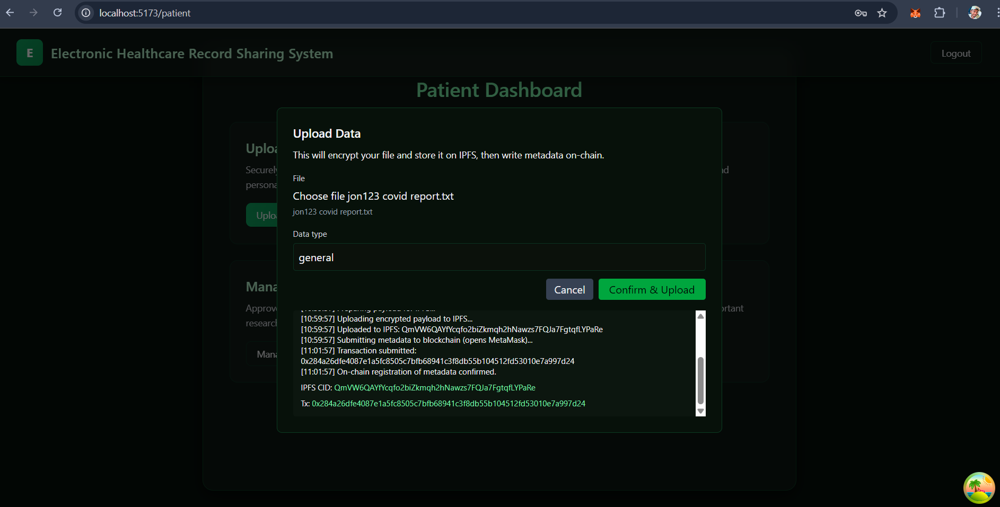
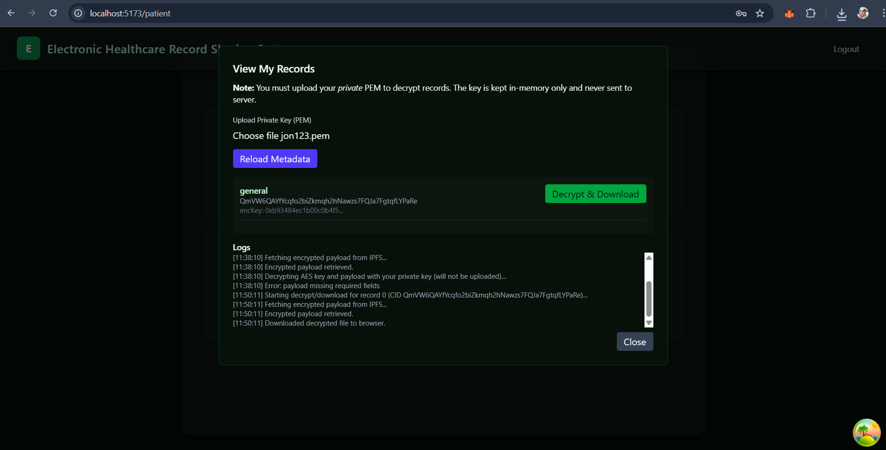

# 🏥 Blockchain-Based Electronic Health Record (EHR) Management System

A **fully decentralized, cryptographically secure EHR management platform** built using:

- **Hyperledger Besu** (Private Ethereum Network)
- **Solidity Smart Contracts**
- **Hybrid RSA–AES Client-Side Encryption**
- **IPFS (InterPlanetary File System)** for encrypted storage
- **React + Vite (Frontend UI)**
- **Node.js + Express + MongoDB (Authentication Backend)**
- **MetaMask for on-chain identity verification**

This system demonstrates how blockchain, cryptography, and decentralized storage can be combined to build a **secure, private, tamper-proof healthcare record management platform**.

---

# 🌐 Live Demo

🚀 **Frontend (Render):**  
https://blockchain-ehr-system1.onrender.com/

--- 
# 🌐Complete Video Demo

https://youtu.be/b-HOhCw3zxo?si=zYbMmIbhHP5GEj-j

---

# 📌 Key Features

### 🔐 1. Secure User Authentication

- JWT-based login/signup
- Password hashing using bcrypt
- MongoDB storage of user credentials
- Client-side RSA keypair generation (never stored on server)

### 🔑 2. Hybrid Cryptographic Architecture

- AES-256 for actual file encryption
- RSA-OAEP for securing AES key
- Keccak256 hashing → bytes32 blockchain identity
- Private keys never leave the browser

### 🧾 3. Decentralized Metadata Storage

- All file metadata (CID, encrypted AES key, dataType) stored immutably on blockchain
- Smart contracts ensure owner-only access

### 📦 4. Encrypted File Storage on IPFS

- Browser uploads encrypted JSON payload
- IPFS returns CID
- CID stored on blockchain

### 🧭 5. Patient-Centric Access

- Patients can upload, view, decrypt, and download their medical files
- Researchers and Care Providers follow similar flows

### 🎨 6. Beautiful UI

- Built using React + TailwindCSS
- Includes:
  - Homepage
  - Authentication (Signup + Login)
  - Patient Dashboard
  - Upload Modal
  - View Records Modal

---

# 💻 Technology Stack

### Blockchain

- Hyperledger Besu
- Solidity
- Ethers.js
- MetaMask

### Cryptography

- RSA keypair generation (Forge)
- AES-256-CBC encryption
- RSA-OAEP key wrapping
- Keccak256 hashing

### Storage

- IPFS distributed storage
- MongoDB for user accounts

### Frontend

- React
- Vite
- TailwindCSS
- TanStack React Query
- Toastify

### Backend

- Node.js + Express
- MongoDB + Mongoose
- JWT Authentication

---

# 🔐 Cryptographic Workflow (Summary)

1. RSA keypair generated client-side
2. Public key → Keccak256 → bytes32 userHash
3. Upload workflow:
   - AES key generated
   - File encrypted with AES
   - AES key encrypted using RSA-OAEP
   - Payload stored on IPFS
   - CID + encrypted key stored on blockchain
4. View workflow:
   - Metadata fetched from blockchain
   - Payload fetched from IPFS
   - Private key decrypts AES key
   - AES decrypts medical file

---

# 🛠️ Installation Guide

### 1. Clone Repository

```bash
git clone https://github.com/<your-username>/Blockchain_EHR_system.git
cd Blockchain_EHR_system
```

### 2. Start Backend

```bash
cd backend
npm install
npm start
```

### 3. Start Besu Blockchain

```bash
cd smart_contracts
./run.sh
```

### 4. Start Frontend

```bash
cd client
npm install
npm run dev
```

---

# 📸 Snapshots

## Landing page


## Authentication


## Upload Data



## View Records



---

# 📜 License

MIT License.
